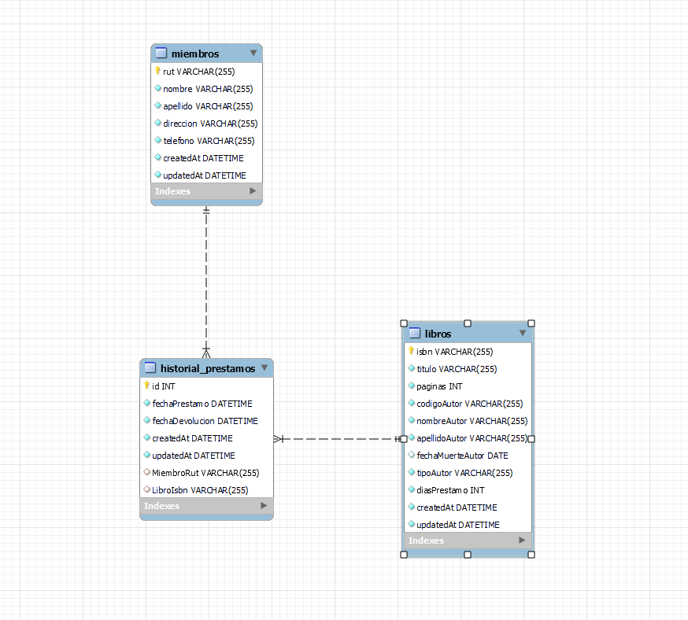

 <h1 align= left ><b>Grupal 6 M7 /EquipoBoldo</b> </h1>

<br>

<h2><b>Descripción del Proyecto</b> </h2>

📝 Se requiere modelar una base de datos para una biblioteca, de acuerdo a las reglas de negocio que ha definido el
cliente. Debes prestar especial atención en la relación entre las entidades para crear el modelo conceptual, físico y
lógico e implementar la base de datos de acuerdo a dicho modelamiento.
En detalle,se requiere modelar lo siguiente:
En la biblioteca se guardan los siguientes datos para cada préstamo que se realiza: los datos del libro (ISBN, título,
número de páginas, código del autor, nombre y apellido del autor, fecha de nacimiento y muerte del autor, tipo de
autor (principal, coautor)), datos del préstamo (fecha de inicio, fecha esperada de devolución y fecha real de
devolución) y los datos del socio (rut, nombre, apellido, dirección y teléfono).
Además,se deben considerar las siguientesrestricciones:
▪ Se registra una única dirección y teléfono para cada socio.
▪ El ISBN (International Standard Book Number), es un número de 13 cifras que identifica de una manera
única a cada libro o producto de editorial publicado.
▪ Para este ejercicio, asumirá que la biblioteca posee un ejemplar de cada libro.
▪ El número único del autor es un correlativo interno que maneja la biblioteca para identificarlos y facilitar la
búsqueda.
▪ Un libro tiene al menos un autor principal, puede tener ademásregistrado un coautor.
▪ Un socio sólo puede pedir un libro a la vez.

Realizar las siguientes consultas

a. Mostrar todos los libros que posean menos de 300 páginas:

SELECT * FROM Libros WHERE numero_de_paginas < 300;

b. Mostrar todos los autores que hayan nacido después del 01-01-1970:

SELECT * FROM Autores WHERE fecha_nacimiento > '1970-01-01';

c. ¿Cuál es el libro más solicitado?

SELECT ISBN_libro, COUNT(*) AS veces_prestado
FROM Prestamos
GROUP BY ISBN_libro
ORDER BY veces_prestado DESC
LIMIT 1;

d. Si se cobrara una multa de $100 por cada día de atraso, mostrar cuánto debería pagar cada usuario que entregue el préstamo después de 7 días:

SELECT rut_socio, SUM(DATEDIFF(fecha_real_devolucion, fecha_esperada_devolucion) - 7) * 100 AS multa
FROM Prestamos
WHERE DATEDIFF(fecha_real_devolucion, fecha_esperada_devolucion) > 7
GROUP BY rut_socio;

<br>

<h2><b>Instrucciones de Instalación</b> </h2> 

⚙️ Para instalar las dependencias necesarias, sigue los siguientes pasos:

1. Clona el repositorio en tu máquina local.
2. Abre una terminal y navega hasta la carpeta del proyecto.
3. Ejecuta el siguiente comando para instalar las dependencias:

   npm install

4. Abrir el archivo html ingresando al https://localhost:3000


<br>

<details>  <summary><b>Ver las instrucciones</b></summary> 


1. Instalar las dependencias:

   ```sh
   npm install
   ```

2. En el caso de no poder instalar las dependencias:

   ```sh
   npm install --force
   ```

3. Las librerias que estamos ocupando `package.json`:

    ````sh
    ... 
    "name": "helpers",
    "version": "1.0.0",
    "description": "",
    "main": "index.js",
    + "type": "module",
    "scripts": {
    "test": "echo \"Error: no test specified\" && exit 1"
    },
    "author": "",
    "license": "ISC",
    "dependencies": {
    "mysql2": "^3.6.0",
    "sequelize": "^6.32.1"
    }
    ````

 
</details>

## Funcionalidades :sparkles:

✨ Con nuestra aplicacion con ORM podremos visualizar el siguiente diseño:




<!--  -->

## Participantes del Grupo :busts_in_silhouette:

1. Loreto Godoy : https://github.com/loreGodoyUp

2. Daniel Mendez : https://github.com/danimen81

3. Zimram Blanco : https://github.com/Zimram

4. Jose Fuentealba : https://github.com/JoseFelipeGeo

5. Boris Guiñez : https://github.com/boanguibe

6. Alfonso Mujica : https://github.com/ALFONSOMUJICAS

7. Felipe Andres Parra : https://github.com/33fparra


### Este proyecto está bajo la licencia ADALID.


